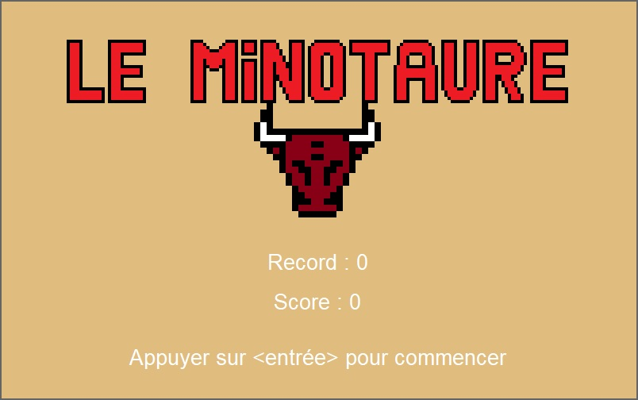
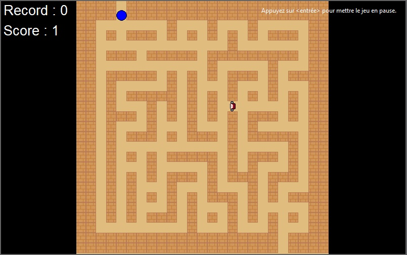
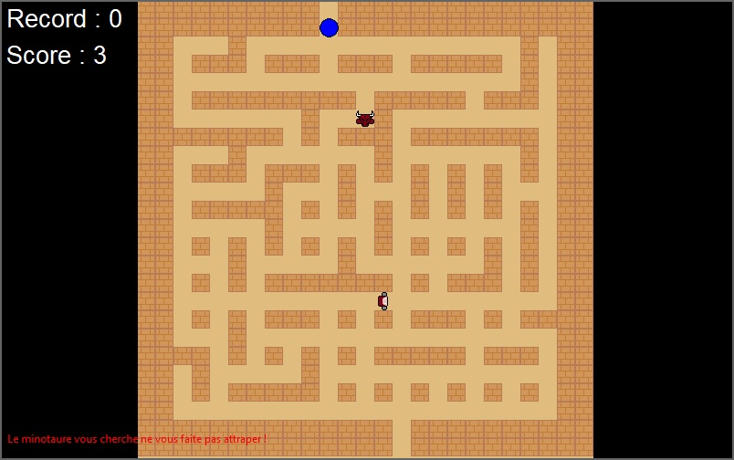
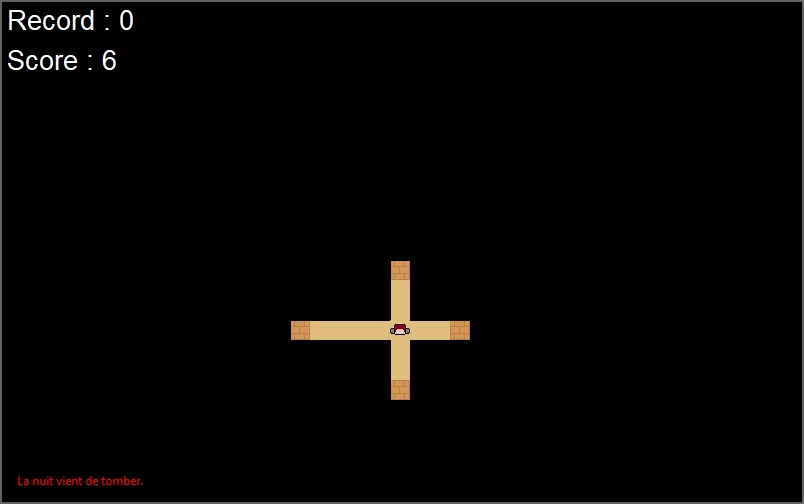

# Python-Minotaure-Game

This is a game in which you will have to find the exit of a labyrinth without getting caught by the minotaur.
## Features
## Installation
1. Download the repository by clicking on `Code > Download ZIP`
2. Extract the ZIP file
3. Run `main.pyw`
## Requirements
- Python 3.7
- Python tkinter library
- Python random library
- Python math library
## Game Captures

